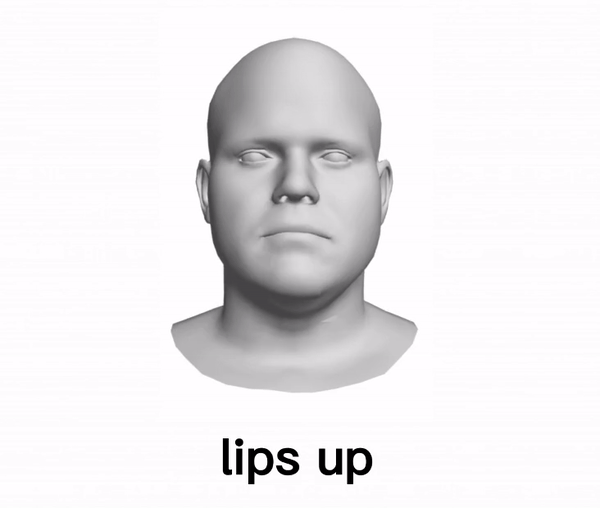
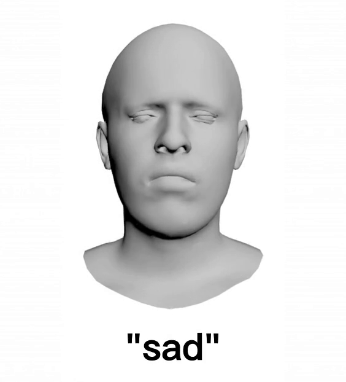
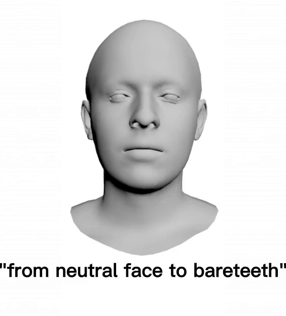
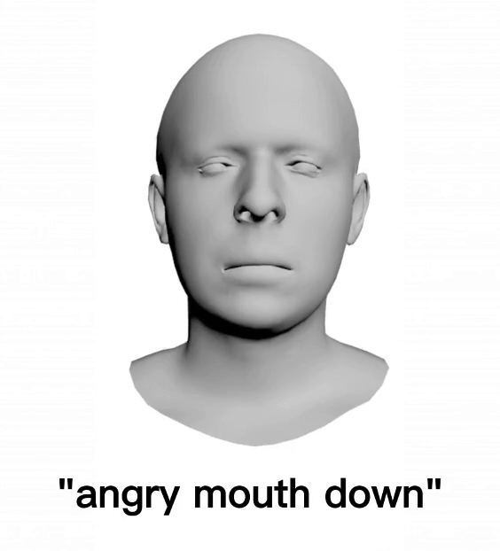
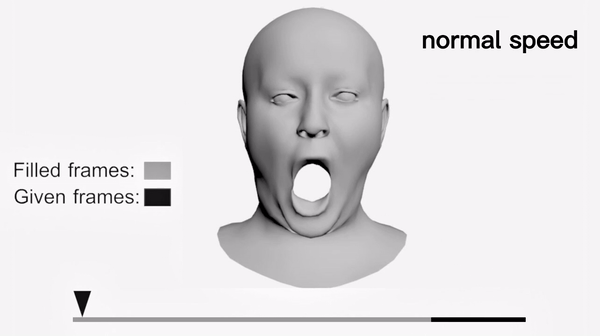
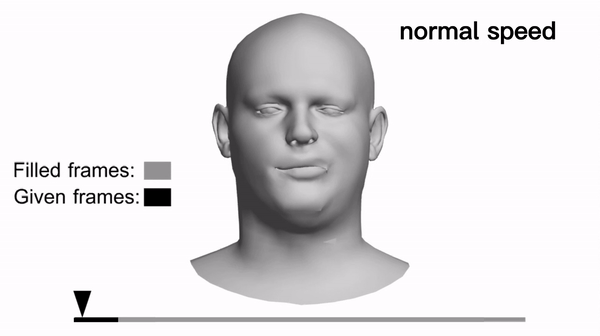
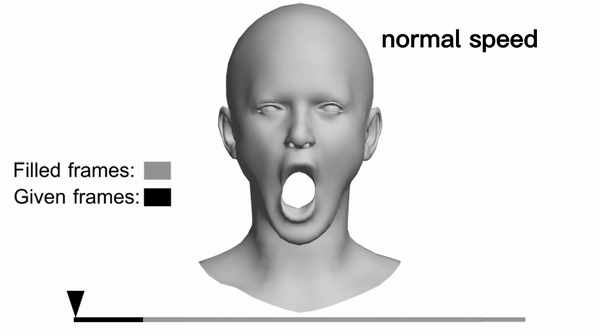

# 4DFM
4D Facial Expression Diffusion Model

## 1. Dataset
We test our method on two commonly used facial expression datasets, [**CoMA**](https://coma.is.tue.mpg.de/) and [**BU-4DFE**](http://www.cs.binghamton.edu/~lijun/Research/3DFE/3DFE_Analysis.html).

## 2. Model architecture

## 3. Video results
Each video will repeat three times.

### 3.1 Label control

Examples

         

### 3.2 Text control

Text to expression examples:

 
 
 

### 3.3 Sequence filling

#### Filling from the beginning.
   

#### Filling in the middle.
   
 
 
#### Filling from the end.
   

## 4. Code
The code will be made available very soon!
