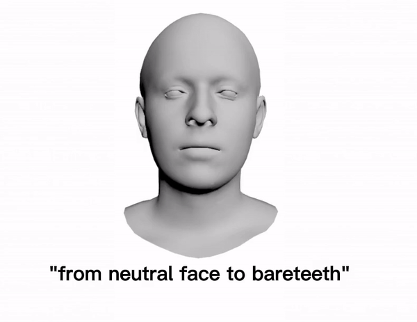
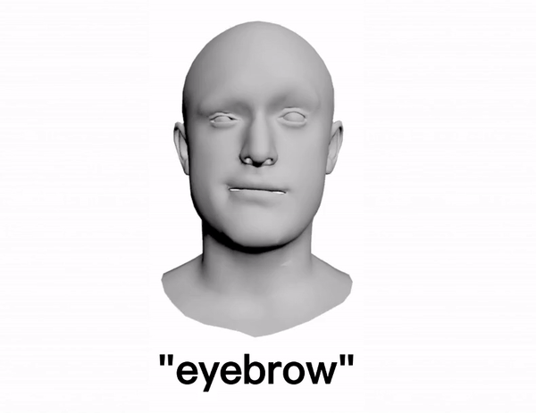

# 4DFM
4D Facial Expression Diffusion Model

## 1. Dataset
We test our method on two commonly used facial expression datasets, [**CoMA**](https://coma.is.tue.mpg.de/) and [**BU-4DFE**](http://www.cs.binghamton.edu/~lijun/Research/3DFE/3DFE_Analysis.html).

## 2. Model architecture

## 3. Video results

### 3.1 Label control

We perform a conditional generation according to the expression label y. 

Examples

         

### 3.2 Text control
We perform a conditional generation according to a text. Note that the input texts “disgust high smile” and “angry mouth down” are the combinations of two terms used for training. For instance, “disgust high smile” is a new description that hasn’t been seen before, which combines “disgust” and “high smile”.

Text to expression examples:

       
 
     

### 3.3 Sequence filling

Similarly to inpainting whose purpose is to predict missing pixels of an image using a mask region as a condition, this task aims to predict missing frames of a temporal sequence by leveraging known frames as a condition.

#### Filling from the beginning.
   

#### Filling in the middle.
   
 
 
#### Filling from the end.
   

### 3.4 Diversity

The specific aim of the 3D facial animation generation is to learn a model that can generate facial expressions that are realistic, appearance-
preserving, rich in diversity, with various ways to condition it. 

#### Diversity of label control

The diversity of the generated sequences in terms of expression is shown hereafter. The meshes are obtained by retargeting the expression of the generated 𝑥0 on the same neutral faces.

mouth side

 

mouth up

 

#### Diversity of Geometry-adaptive generation
In the Geometry-adaptive generation task, we generate a facial expression from a given facial anatomy. This task can also be guided by a classifier. In order to benefit from the consistent and quality expressions adapted to the facial morphology by the DDPM, one can extract a landmark set 𝐿 from a mesh 𝑀, perform the geometry-adaptive task on it to generate a sequence involving 𝐿, and retarget it to 𝑀 by the landmark-guided mesh deformation. We show hereafter the diversity of the generated sequences.

eyebrow

 

lips up

 

### 3.5 Comparison
#### Label control

"high smile"

  
 
 "cheeks in"
 
  
 
 "mouth open"
 
  
 
 #### Text control
 
  
 
  
 
 ### 3.6 Expression retargeting
 
The landmark sequence taken from a sequence of the CoMA dataset is retargeted onto several facial meshes.

  
 
## 4. Code
The code will be made available very soon!
